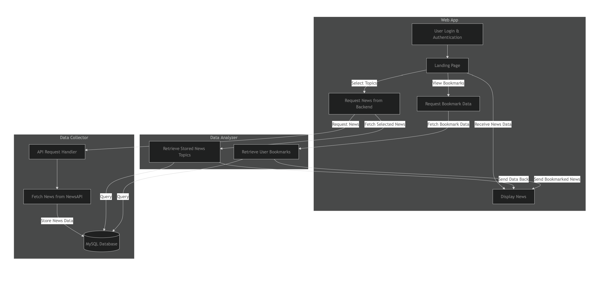

# Capstone Starter

A capstone starter application.

[Deployment on Google Cloud](https://capstone-service-573036605406.us-central1.run.app/)

## Technology stack

This codebase is written [Kotlin](https://kotlinlang.org/) using [Ktor](https://ktor.io/) and [freemarker templates](https://freemarker.apache.org/).
It stores data in [PostgreSQL](https://www.postgresql.org/).
A [GitHub Action](https://github.com/features/actions) runs tests and builds a container.

## Architecture

The Capstone Starter consists of three applications communicating with one Postgres database.

1.  The data collector is a background process that collects data from one or more sources.
1.  The data analyzer is another background process that processes collected data.
1.  The web application displays results to the user.......

[Architecture Diagram](./images/Application_Architecture_Diagram.png)



## Local development

1.  Install Java, [PostgreSQL 17](https://formulae.brew.sh/formula/postgresql@17), and [Flyway](https://formulae.brew.sh/formula/flyway).
    ```shell
    brew install openjdk@21 postgresql@17 flyway
    brew services run postgresql@17
    ```

1.  Create and migrate the local databases.
    ```shell
    psql postgres < ./databases/create_databases.sql
    flyway -user=starter -password=starter -url="jdbc:postgresql://localhost:5432/starter_development" -locations=filesystem:databases/starter migrate
    flyway -user=starter -password=starter -url="jdbc:postgresql://localhost:5432/starter_test" -locations=filesystem:databases/starter migrate 
    ```

1.  Copy the example environment file and fill in the necessary values.
    ```shell
    cp .env.example .env 
    source .env
    ```

1.  Run the collector and the analyzer to populate the database, then run the app and navigate to
    [localhost:8888](http://localhost:8888).

    ```shell
    ./gradlew build
    java -jar applications/collector/build/libs/collector.jar
    java -jar applications/analyzer/build/libs/analyzer.jar
    java -jar applications/app/build/libs/app.jar
    ```

## Create a database schema migration

Create a numbered `.sql` file in the `databases/starter` directory to create a new database schema migration.

```shell
touch databases/starter/V1_description_of_change.sql
```

## Build container

1.  Build container
    ```shell
    docker build -t capstone-starter .
    ```

1.  Run with docker
    ```shell
    docker run --env-file .env.docker --entrypoint ./collect.sh capstone-starter
    docker run --env-file .env.docker --entrypoint ./analyze.sh capstone-starter
    docker run -p 8888:8888 --env-file .env.docker capstone-starter
    ```   
